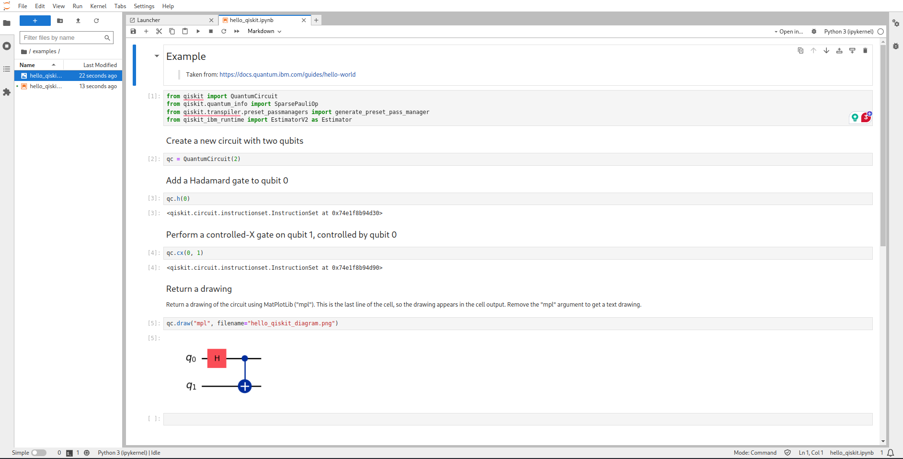

# Qiskit Development Environment with Jupyter Notebook on Docker

This project sets up a Qiskit development environment using [Jupyter Notebook](https://jupyter.org) on Docker. The container is based on jupyter/minimal-notebook image, and, has Qiskit and some useful packages (check `requirements.txt`), allowing you to develop quantum programs locally and execute them inside the container.

## Prerequisites

Make sure you have the following tools installed on your system:

-   [Docker](https://docs.docker.com/get-docker/)
-   [Docker Compose](https://docs.docker.com/compose/install/)

## Setup instructions

> For a fast installation you can run the script `bash setup.sh`

### 0. Clone this repository

Firstly, you need to clone this repository:

```bash
git clone git@github.com:unipr-org/QC.git
```

### 1. Create required folders

```bash
cd jupiter-notebook
mkdir code
```

> Note that the `code` folder will be mounted inside the container and used to store the notebooks.

### 2. Setup group ownership

Usually, the user and group of the host and the container are different. To avoid permission issues, you can change the group ownership of the shared folders to the docker group.

```bash
chown -R :docker <example-directory> <working-directory>
chmod -R 774 <example-directory> <working-directory>
```

> `<example-directory>` and `<working-directory>`, are setted by default as `examples/` and `code/`, respectively. 

### 3. Build the Docker container

To build the Docker image and set up the container without running it immediately, use the following command:

```bash
docker-compose up --build --no-start
```

> This command will create the container but will **not** start it automatically.

### 4. Start the container

Once the build is complete, you can start the container using:

```bash
docker-compose up -d
```

> This command will start the container in the background, and share sessions with the host on port 8888.

### 5. Stop and remove the container

When you're done, you can stop the running container with:

```bash
docker-compose stop
```

To completely remove the container (but keep the image), you can run:

```bash
docker-compose down
```

> This will stop and remove the container and the associated network. All notebooks and data won't be lost because they are stored in the shared folder (`code`).

## Usage

To use the installed environment, you can access the Jupiter Notebook server by opening the following URL in your web browser:

```
http://localhost:8888
```

### VScode integration

If you are using VScode, you can install the [Jupiter extension](https://marketplace.visualstudio.com/items?itemName=ms-toolsai.jupyter) to edit `.ipynb` files, without interacting with the web browser interface.

> Execution of notebooks must be done using the web browser interface.

## Examples

Within the `examples` folder, you can find examples of quantum programs that can be executed using the Jupyter Notebook interface.

An example of a quantum program in Jupiter notebook is the following:

